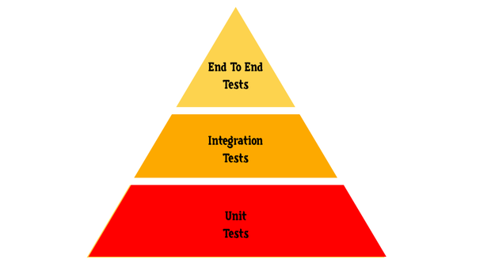
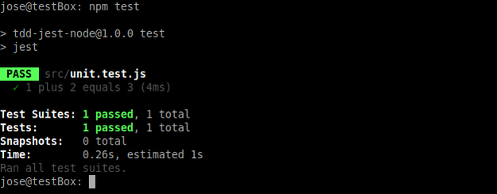
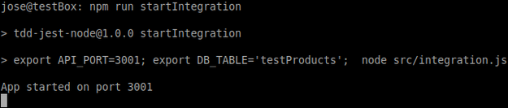
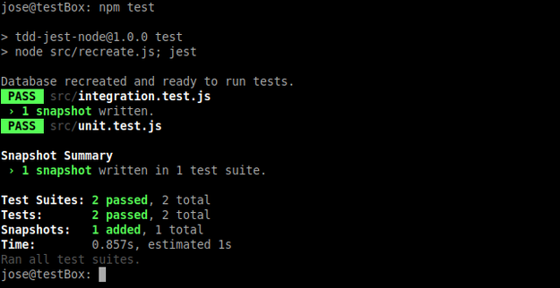
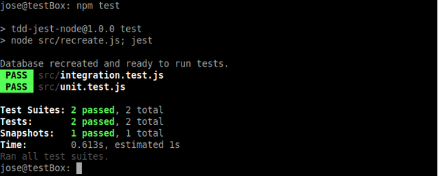
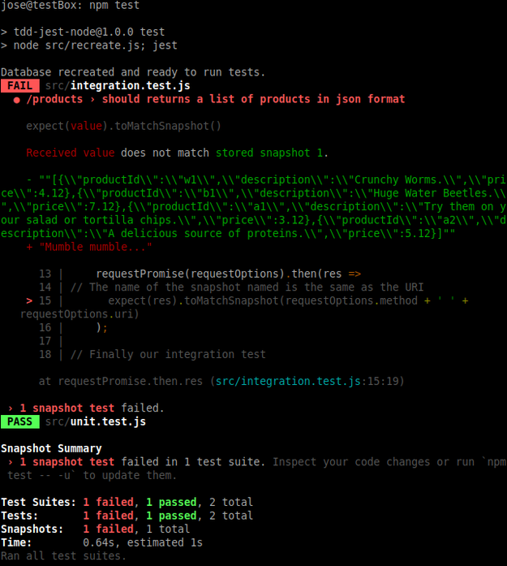

Jest: a different way to test Node applications
===============================================
<p align="center">
   
</p>

The implementation of a test system must be the first thing to do in our applications. We write tests to be confident that everything is working as expected. If something suddenly goes wrong, we want to make sure we know it, and quickly understand what's the matter. 

Why use Jest with Node?
-----------------------

Normally the obvious choice when it comes to testing with Node is Mocha as framework and Chai for assertions.

Jest came out in 2014, and although it initially aroused a lot of interest, the project was inactive for a while. However, Facebook has invested last year in improving Jest, and has recently published some releases with impressive changes that make it worth reconsidering not only for the frontend (in fact it is React's "official" framework) but also for backends.

Jest is Node based, which means it runs tests in a Node environment instead of a real browser. The tests are run inside a fake DOM implementation.


 Let's start
 -----------

I do trust that if you are reading this you are familiar with how to start a project in Node. So let's start without further ado:

```
$ mkdir tdd-jest-node
$ cd tdd-jest-node/
$ npm init -y
```

Let's install the Jest library:
```
$ npm install jest --save-dev
```
And let's modify the “package.json” section like this:
```
"scripts": {
"test": "jest"
},
"jest": {
"testEnvironment": "node"
},
```

Different tests
---------------


There are a variety of different tests that we can run in our applications, however, for simplicity we can always refer to the following test pyramid for reference.

<p align="center">
   
</p>


Our first Unit Test
-------------------

A Unit Test is a process in which you take the smallest piece of verifiable code from your application, isolate it from the rest of the application and subject it to a series of tests to verify its correct operation. 

Let's write a function:

```javascript
// tdd-jest-node/src/unit.js
module.exports = function (a,b) {
return a + b; };
```

And now our first test:

```javascript
// tdd-jest-node/src/unit.test.js
const sum = require('./unit');
test('1 plus 2 equals 3', () => {
 expect(sum(1,2)).toBe(3);
})
```

Now, if we run the ```test``` script from the directory of our application:

```
$ npm run test
```

We'll have something like this:

<p align="center">
   
</p>


We can see that we have passed the first test.  We can consider the previous example "1 plus 2 equals 3" as a valid, though minimum, example of Unit Test.


Integration Tests
-----------------


As the name suggests, in this type of test many units are combined and tested effectively as a whole. The main purpose of this test is to expose any failures in integration between multiple units.

When we talk about Node and/or Express we are often talking about APIs. And an error in your API can be disastrous for your service. Making sure it works properly is critical and you can't always rely on Unit Tests to be sure. Jest's snapshots have been very successful in frontent testing, so why not apply the same technology to the backend? 

The setup we are going to use includes the Express and SQlite libraries, so let's install them: 
```
$ npm install express sqlite -s
```

Now let's write a module that after an HTML request returns information from our database:

```javascript
// tdd-jest-node/src/integration.js

const express = require('express');
const app = express();
// The port and the database table will be defined by environment variables, 
// so we can deploy unit tests, integration, etc. on different ports.
const port = process.env.API_PORT || 3000;
const table = process.env.DB_TABLE || "products";
const sqlite3 = require('sqlite3').verbose();
// For the sake of brevity, let's use a table for testing tasks instead a complete dedicate database.
const productsDBPath = './databases/products.db';
var adminRouter = express.Router();
// Here we will return a summary with all the products of the database in json format.
adminRouter.get('/',function(req,res){ 
 let db = new sqlite3.Database(productsDBPath, (err) => {
 if (err) {
    console.log("Error: ",err.message);
    return;
 }
 let query = `SELECT productId,description, price FROM ${table};`; 
 
 db.all(query, (err, rows) => {
   if(err) {
      console.log("Error:", err);
      return;
    }; 
    res.json(JSON.stringify(rows));
    });
  });
});

// A simple greeting message.
app.get('/',function (req, res) {
 res.send('Welcome to Bug-Based Delicacies!')
})

app.use('/products',adminRouter);

app.listen(port, function(){
    console.log('App started on port',port);
})
```

Let's also write a module that recreates a table within our database so that we can always use it as the basis for our tests:


```javascript
// tdd-jest-node/src/recreate.js

// Here we are going to recreate a toy table in our database so that we can run tests over and over again.
function recreateTable(){
  const sqlite3 = require('sqlite3').verbose();
  const productsDBPath = './databases/products.db';
  const testProducts = [
    {productId:'w1', name: 'larvets', description: 'Crunchy Worms.', price: 4.12},
    {productId:'b1', name: 'beetles', description: 'Huge Water Beetles.', price: 7.12},
    {productId:'a1', name: 'anteggs', description: 'Try them on your salad or tortilla chips.', price: 3.12},
    {productId:'a2', name: 'termites', description: 'A delicious source of proteins.', price: 5.12}
  ]

let db = new sqlite3.Database(productsDBPath, (err) => {
  if (err) {
    console.log("Error: ",err.message);
    return;
 }
 console.log('Database recreated and ready to run tests.');
});

db.run("DROP TABLE if exists testProducts");
db.run("CREATE TABLE if not exists testProducts (id INTEGER PRIMARY KEY, productId TEXT NOT NULL, name TEXT NOT NULL, description TEXT, price INT NOT NULL)");

for(let i = 0; i < testProducts.length; i++){
 db.serialize(() => {
    let stmt = db.prepare("INSERT INTO testProducts VALUES (NULL,(?),(?),(?),(?))");
    stmt.run( [testProducts[i].productId,testProducts[i].name,testProducts[i].description,testProducts[i].price] );
    stmt.finalize();
  }); 
 };
}

recreateTable();
```

What we need now is a way to make HTTP request in a simple way. The ```request-promise``` library is a good option for use in our integration tests. Let's set it up:

```
$ npm install request-promise --save-dev 
```

And let's write our module:

```javascript
// tdd-jest-node/src/integration.test.js

// We will use this very handy library to make requests
const requestPromise = require('request-promise')
// In case we need to change the URL for tests 
const api = process.env.API_URL || 'http://localhost:3001'

// Here we are going to check the result of previous snapshots
const testIntegration = (requestOptions, options = {}) =>
 () => requestPromise(requestOptions).then(res =>
// The name of the snapshot named is the same as the URI
 expect(res).toMatchSnapshot(requestOptions.method + ' ' + requestOptions.uri)
        );

// Finally our integration test
describe('/products', () => {
 test('should returns a list of products in json format', testIntegration({method:'GET',uri: api + '/products/'}));
})
```


Now let's change the ```scripts``` section in our ```package.json``` file in order to automate the tests:

```
"scripts": {
"start": "node src/integration.js",
"startIntegration": "export API_PORT=3001; export DB_TABLE='testProducts'; node src/integration.js",
"test": "node src/recreate.js; jest",
"testReset": "jest -u"
},
```

Let's explain the different options:

■ ```start``` :  will deploy Express in port 3000 (for production for example)

■ ```startIntegration```: will deploy Express to port 3001 for our tests

■ ```test```: recreate our table in the database and run the tests

■ ```testReset``` : is just another way to eliminate obsolete snapshots


Let’s try it!
-------------


The first thing to do is to deploy Express in "test mode":
```
$ npm run startIntegration
```
And we'll have:


<p align="center">
   
</p>


And then in another shell:

```
$ npm test
```

<p align="center">
   
</p>


As we can see, both the "integration" and "unit" tests have passed correctly. We can also see that a snapshot has been written.

Let's run the tests again:
```
$ npm test
```

<p align="center">
   
</p>


This time the tests have been passed again but no snapshot has been written. Jest has used the previous one.

Let's break something!
----------------------

To do this, let's slightly modify ```integration.js```. Like this:

```javascript
// tdd-jest-node/src/integration.js

[...] 
 adminRouter.get('/',function(req,res){ 
    let db = new sqlite3.Database(productsDBPath, (err) => {
    if (err) {
      console.log("Error: ",err.message);
      return;
    }

   var query = `SELECT productId,description, price FROM ${table};`; 
   db.all(query, (err, rows) => {
     if(err) {
        console.log("Error:", err);
        return;
     }; 
   // res.json(JSON.stringify(rows));  // RIGHT HERE!
   res.send("Mumble mumble...")
    });
  });

[...]
```

And let's run the tests again. Let's deploy Express first:
```
$ npm run startIntegration
```
And in another shell window:
```
$ npm test
```

<p align="center">
   
</p>

Red warnings everywhere!


Wrapping Up
-----------

Jest is not just snapshots tests and a lot of people are starting to use it for their tests and not just in the frontend anymore. So, it's worth taking a look at it.

Although, before closing this tutorial, one last question about snapshots: Are they really the panacea they seem to be? Well, I encourage you to read this article for the answer: <a href="https://blog.kentcdodds.com/effective-snapshot-testing-e0d1a2c28eca">Effective Snapshot Testing</a>
